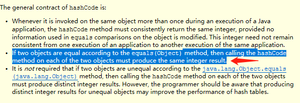

## 如何排查程序问题（对水哥培训进行整理）

### 典型问题类型

#### 宕机

- 数据库不响应

  - CPU高
  - 磁盘IO高

- 应用不响应

  - CPU/网络
  - OOM
  - 线程阻塞
    - 资源等待
    - 死锁
      概率小
      因为大部分人不太会写多线程代码
      通常是一把大锁

- 备注：

  响应很慢的两种情况

  - cpu高，线程堆栈日志查看正在运行（Runnable）的线程日志
  - cpu不高，查看被阻塞（Blocked，Waiting）的线程日志

#### 线程安全问题

- [HashMap CPU 100%](https://coolshell.cn/articles/9606.html)  
- HashMap出现多个相同的key
- SimpleDateFormat
- 多线程穿插执行导致数据紊乱
  - A用户修改案件的案号
  - B用户全量更新案件信息

问题：while(true) 死循环会不会导致cpu100%

不会，只会导致一个cpu核被占用，但一般服务器都是多个cpu，多个核

#### 各种程序错误，不一而足

- 分治法
- 底层包通常不会错，错的更可能是我们
  - 没有灵异事件

#### 代码问题

##### 可以短路操作

审判组织成员冲突判断和合议庭成员冲突判断可以放在 else中


#### Integer等包装类型需要用equals判断是否相等


```java
public static void main(String[] args) {
		Integer a = 18;
		Integer b = 18;
		Integer c = 128;
		Integer d = 128;
		System.out.println(a == b);
		System.out.println(c == d);
	}
	
结果：
true
false
```

##### 重写equals,需要重写HashCode




##### SimpleDateFormat不是线程安全的，做为全局变量存在风险

```java
	static SimpleDateFormat sdf = new SimpleDateFormat("yyyy-MM-dd HH:mm:ss:SSS");
	public static void main(String[] args) {
		for(int i = 0;i<1000;i++){
			new Thread(()->{
				Date now = new Date();
				String s1 = sdf.format(now);
				String s2 = sdf.format(now);
				if(!s1.equals(s2)){
					System.out.println("s1!=s2");
				}
			}).start();
		}
	}
结果：
s1!=s2
s1!=s2
```

#### 不要重复使用流


51这个位置已经使用了response的outputstream
58这个位置再想用就会报错
java.lang.IllegalStateException: getOutputStream() has already been called for this response

##### 注意

对于只是new FileInputStream 不会造成内存溢出，因为只是建立管道，并没有实际加载到内存

对于ByteArrayInputStream会加载到内存中

##### 对于常量替换class的方式不好使


编译成class文件之后，常量会被替换，不再引用常量类中的变量

##### System.out.println是sync调用，可能导致阻塞


##### 循环

时间复杂度是O(n的平方)
如果改为map的话，事件复杂度就是O(n)


##### 每次都会新建线程池，而且线程池没手动关闭，导致线程泄露


问题：

新创建的线程在主线程执行完之后会被回收吗？

不会，每次创建新创建的线程都可以当做一个GCROOT

除非是守护线程，被守护的线程结束，守护线程也跟着结束


### show-busy-java-threads.sh

[链接](https://github.com/oldratlee/useful-scripts/blob/master/docs/java.md#-show-busy-java-threads)

