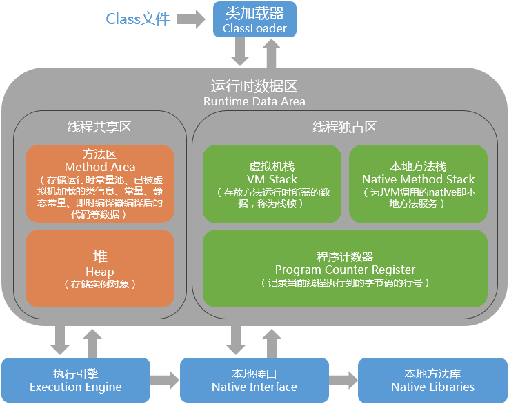

## JVM自动内存管理

### 一：运行时数据区域

#### 1：程序计数器

- 存储当前线程执行的字节码的地址/位置
- 每个线程都有自己独立的程序计数器，是线程非共享区
- java 多线程是通过线程轮转并分配一定处理器的执行时间来实现
- 如果当前执行的是本地方法，当前线程的程序计数器为空（Undefined）

#### 2.java虚拟机栈、本地方法栈（调用本地方法）

- 描述的是java方法执行的内存模型，每个方法执行的同时会创建一个栈帧
- 局部变量表：
  - 基本数据类型 + 对象引用 + returnAddress类型（指向一个地址）
  - 所需要的内存空间在编译时是完全确定的，方法运行时是不会改变局部变量表的大小。
  - 只有long和double类型占两个局部变量空间，其他的数据类型都只占一个内存空间
- 操作数栈
- 动态链接
- 方法出口
- 异常
  - StackOverflowError: 栈溢出 ，线程请求栈的深度大于虚拟机所允许的深度
  - OutOfMemoryError ：扩展时无法申请到足够的内存

#### 3.java堆

唯一的目的就是存储对象实例和数组

是垃圾收集器的主要区域，因此被称为GC堆

分代收集算法：更好地回收内存，更快的分配内存

分为新生代，老年代:

- 新生代：Eden,Survivor
- 老年代：Old

- 新生代 ( Young ) 与老年代 ( Old ) 的比例的值为 1:2 ( 该值可以通过参数 –XX:NewRatio 来指定 )

永久代（perm）在方法区中;

线程私有的分配缓存区，TLAB:Thread Local Allocation Buffer

-XX:SurvivorRatio=8 决定新生代中Eden区与一个Survivor区空间的比例为 8：1

- Minor GC

Minor GC指新生代GC，即发生在新生代（包括Eden区和Survivor区）的垃圾回收操作，不会对老年代进行垃圾回收，young gen中的eden区分配满的时候，会触发Minor GC。因为新生代中大多数对象的生命周期都很短，所以发生Minor GC的频率很高，虽然它会触发stop-the-world，但是它的回收速度很快

- Major GC

 Major GC清理Tenured区，用于回收老年代，出现Major GC通常会出现至少一次Minor GC。 

- Full GC

Full GC是针对整个新生代、老生代、元空间（metaspace，java8以上版本取代perm gen）的全局范围的GC。Full GC不等于Major GC，也不等于Minor GC+Major GC，发生Full GC需要看使用了什么垃圾收集器组合，才能解释是什么样的垃圾回收。

当准备要触发一次young GC时，如果发现统计数据说之前young GC的平均晋升大小比目前old gen剩余的空间大，则不会触发young GC而是转为触发full GC（因为HotSpot VM的GC里，除了CMS的concurrent collection之外，其它能收集old gen的GC都会同时收集整个GC堆，包括young gen，所以不需要事先触发一次单独的young GC）；或者，如果有perm gen的话，要在perm gen分配空间但已经没有足够空间时，也要触发一次full GC；或者System.gc()、heap dump带GC，默认也是触发full GC。

看看R大怎么说： https://www.zhihu.com/question/41922036/answer/93079526 

#### 4.方法区（永久代）（jdk8使用元空间代替）

用于存储加载的类信息，常量，静态变量、即时编译器编译后的代码等数据

可以称为永久代  但并不等价，只是把GC分代收集扩展到方法区，

但只是对于HotSpot虚拟机而言，对其他如IBM J9等不存在永久带的概念

-XX:PermSize=64M JVM初始分配的非堆内存

-XX:MaxPermSize=128M JVM最大允许分配的非堆内存，按需分配

现在官方也逐步放弃永久带改为Native Memory 来实现方法区，

JDK 1.7已经把以前放在永久代的**字符串常量池**和静态变量等移出，到了jdk1.8完全放弃永久代的概念，使用元空间代替

这个区域主要回收的目标是针对常量池的回收和对类型的卸载

当方法区无法满足内存分配需求时，将会出现OutOfMemoryError 

 https://www.cnblogs.com/paddix/p/5309550.html 

#### 5.运行时常量池（Runtime Constant Pool）

- 是方法区的一部分
- 用于存放编译期生成的各种字面量和符号引用
- 由符号引用翻译出来的直接引用也存储在运行时常量池中

Class 文件中包含：

- 类的版本、字段、方法、接口等描述信息
- 常量池表 ：用于存放编译期生成的各种字面量和符号引用

产生的方式：

- 预置入Class文件中的常量池
- String类的intern()方法

#### 6.直接内存

NIO:引入基于通道（channel）与缓冲区（Buffer）的I/O方式，可以使用native函数库直接分配堆外内存，然后堆中的DirectByteBuffer对象作为这块内存的引用进行操作

### HotSopt虚拟机 对象探秘

虚拟机在java堆中对象分配、布局和访问过程；

#### 对象的创建

1. 在常量池中定位类的符号引用
2. 分配内存，防止冲突的两种方式
   - 同步：CAS+失败重试的方式
   - TLAB
3. 初始化成默认值
4. 必要设置（对象头）
5. 执行构造方法
6. 将对象引用赋给变量，使变量通过变量可以访问到对象

步骤5和步骤6可能会发生指令重排（出现DCL问题）

#### 对象的内存布局

##### 对象的存储布局

- 对象头
- 实例数据
- 对齐填充

##### 对象头

- **运行时数据**（mark word） :hashCode，GC分代年龄，锁状态标志，线程持有的锁，偏向线程ID,偏向时间戳
- **类型指针**：类型元数据的指针，找到该对象是哪个类的实例
- **数组长度**（数组类型特有）

##### 实例数据

会按照一定的顺序分配内存空间，一般相同类型的数据回分配到一起存放

#### 对象访问定位

- 使用句柄：reference存储的是稳定的句柄地址，对象被移动（如发生GC）时只改变句柄中的指针，reference不变
- 使用直接指针：速度更快，节省一次指针定位的时间开销，HotSpot虚拟机采用这种

#### GC优化

如何预估最大堆的大小，先理解一个概念，**活跃数据的大小**

**活跃数据的大小**：应用程序稳定运行时长期存活对象在堆中占用的空间大小，也就是**Full GC后**堆中老年代占用空间的大小；

可以通过GC日志中Full GC之后老年代数据大小得出，比较准确的方法是在程序稳定后，多次获取GC数据，通过取平均值的方式计算活跃数据的大小。活跃数据和各分区之间的比例关系如下（见参考文献1）：

| 空间   | 倍数                                    |
| :----- | :-------------------------------------- |
| 总大小 | **3-4** 倍活跃数据的大小                |
| 新生代 | **1-1.5** 活跃数据的大小                |
| 老年代 | **2-3** 倍活跃数据的大小                |
| 永久代 | **1.2-1.5** 倍Full GC后的永久代空间占用 |

例如，根据GC日志获得老年代的活跃数据大小为300M，那么各分区大小可以设为：

> 总堆：1200MB = 300MB × 4* 新生代：450MB = 300MB × 1.5* 老年代： 750MB = 1200MB - 450MB*

这部分设置仅仅是堆大小的初始值，后面的优化中，可能会调整这些值，具体情况取决于应用程序的特性和需求。

