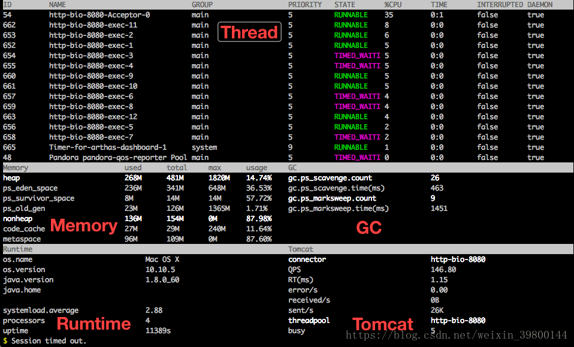

### 当你遇到以下类似问题而束手无策时，`Arthas`可以帮助你解决

- 这个类从哪个 jar 包加载的？为什么会报各种类相关的 Exception？
- 我改的代码为什么没有执行到？难道是我没 commit？分支搞错了？
- 遇到问题无法在线上 debug，难道只能通过加日志再重新发布吗？
- 线上遇到某个用户的数据处理有问题，但线上同样无法 debug，线下无法重现！
- 是否有一个全局视角来查看系统的运行状况？
- 有什么办法可以监控到JVM的实时运行状态？

`Arthas`支持JDK 6+，支持Linux/Mac/Winodws，采用命令行交互模式，同时提供丰富的 `Tab` 自动补全功能，进一步方便进行问题的定位和诊断。

### 安装

- 下载[arthas-boot.jar](https://alibaba.github.io/arthas/arthas-boot.jar)，然后用`java -jar`的方式启动
- 如果想远程通过websocket连接Arthas，需要指定启动参数 `--target-ip 0.0.0.0` 参数
- 如果本地访问,使用http://127.0.0.1:8563来访问websocket

### attach 进程

- java -jar arthas-boot.jar + 进程号

> ```
> C:\Users\zjf-pc\Desktop\arthas>java -jar arthas-boot.jar 4840
> [INFO] arthas-boot version: 3.1.0
> [INFO] arthas home: C:\Users\zjf-pc\.arthas\lib\3.1.0\arthas
> [INFO] Try to attach process 4840
> [INFO] Found java home from System Env JAVA_HOME: C:\Program Files\Java\jdk1.8.0
> _171
> [INFO] Attach process 4840 success.
> ```

- 启动后直接选择需要attach 进程

> ```
> C:\Users\zjf-pc\Desktop\arthas>java -jar arthas-boot.jar
> [INFO] arthas-boot version: 3.1.0
> [INFO] Found existing java process, please choose one and hit RETURN.
> * [1]: 1144 org.jetbrains.idea.maven.server.RemoteMavenServer
>   [2]: 1832 org.jetbrains.jps.cmdline.Launcher
>   [3]: 5692 org.jetbrains.kotlin.daemon.KotlinCompileDaemon
>   [4]: 5900
>   [5]: 7004 com.Test
> 1
> [INFO] arthas home: C:\Users\zjf-pc\.arthas\lib\3.1.0\arthas
> [INFO] Try to attach process 1144
> [INFO] Found java home from System Env JAVA_HOME: C:\Program Files\Java\jdk1.8.0
> _171
> [INFO] Attach process 1144 success.
> ```

### 常用命令

| 命名          | 说明                                                         |
| ------------- | :----------------------------------------------------------- |
| *dashboard*   | 当前系统的实时数据面板                                       |
| *thread*      | 查看当前 JVM 的线程堆栈信息                                  |
| *jvm*         | 查看当前 JVM 的信息                                          |
| *sc*          | 查看JVM已加载的类信息                                        |
| *sm*          | 查看已加载类的方法信息                                       |
| *jad*         | 反编译指定已加载类的源码                                     |
| *classloader* | 查看classloader的继承树，urls，类加载信息，使用classloader去getResource |
| *monitor*     | 方法执行监控                                                 |
| *watch*       | 方法执行数据观测                                             |
| *trace*       | 方法内部调用路径，并输出方法路径上的每个节点上耗时           |
| *stack*       | 输出当前方法被调用的调用路径                                 |
| *tt*          | 方法执行数据的时空隧道，记录下指定方法每次调用的入参和返回信息，并能对这些不同的时间下调用进行观测 |
| *reset*       | 重置增强类，将被 Arthas 增强过的类全部还原，Arthas 服务端关闭时会重置所有增强过的类 |
| *quit*        | 退出当前 Arthas 客户端，其他 Arthas 客户端不受影响           |
| *shutdown*    | 关闭 Arthas 服务端，所有 Arthas 客户端全部退出               |

#### 1、dashboard

> 当前系统的实时数据面板，按 ctrl+c 退出。

- ID: Java级别的线程ID，注意这个ID不能跟jstack中的nativeID一一对应
- NAME: 线程名
- GROUP: 线程组名
- PRIORITY: 线程优先级, 1~10之间的数字，越大表示优先级越高
- STATE: 线程的状态
- CPU%: 线程消耗的cpu占比，采样100ms，将所有线程在这100ms内的cpu使用量求和，再算出每个线程的cpu使用占比。
- TIME: 线程运行总时间，数据格式为`分：秒`
- INTERRUPTED: 线程当前的中断位状态
- DAEMON: 是否是daemon线程



#### 2.thread

> 查看当前线程信息，查看线程的堆栈

| 参数名称      | 参数说明                              |
| ------------- | :------------------------------------ |
| *id*          | 线程id                                |
| [n:]          | 指定最忙的前N个线程并打印堆栈         |
| [b]           | 找出当前阻塞其他线程的线程            |
| [i `<value>`] | 指定cpu占比统计的采样间隔，单位为毫秒 |

#### 3.getstatic

通过getstatic命令可以方便的查看类的静态属性。使用方法为`getstatic class_name field_name`

#### 4.ognl

执行ognl表达式

- 调用静态函数：ognl '@com.Test@print("sss")'
- 获取静态类的静态字段：ognl '@com.Test@s'

...

#### 5.sc

查看JVM已加载的类信息,“Search-Class” 的简写，这个命令能搜索出所有已经加载到 JVM 中的 Class 信息

例：sc java.util.AbstractList

##### 参数说明

| 参数名称         | 参数说明                                                     |
| ---------------- | ------------------------------------------------------------ |
| *class-pattern*  | 类名表达式匹配                                               |
| *method-pattern* | 方法名表达式匹配                                             |
| [d]              | 输出当前类的详细信息，包括这个类所加载的原始文件来源、类的声明、加载的ClassLoader等详细信息。 如果一个类被多个ClassLoader所加载，则会出现多次 |
| [E]              | 开启正则表达式匹配，默认为通配符匹配                         |
| [f]              | 输出当前类的成员变量信息（需要配合参数-d一起使用）           |
| [x:]             | 指定输出静态变量时属性的遍历深度，默认为 0，即直接使用 `toString` 输出 |

sc 默认开启了子类匹配功能，也就是说所有当前类的子类也会被搜索出来，想要精确的匹配，请打开`options disable-sub-class true`开关

#### 6.sm

“Search-Method” 的简写，这个命令能搜索出所有已经加载了 Class 信息的方法信息

`sm` 命令只能看到由当前类所声明 (declaring) 的方法，父类则无法看到。

参数说明

| 参数名称         | 参数说明                             |
| ---------------- | ------------------------------------ |
| *class-pattern*  | 类名表达式匹配                       |
| *method-pattern* | 方法名表达式匹配                     |
| [d]              | 展示每个方法的详细信息               |
| [E]              | 开启正则表达式匹配，默认为通配符匹配 |

#### 7.dump

dump 已加载类的 bytecode 到特定目录

#### 8.jad

> 反编译指定已加载类的源码

`jad` 命令将 JVM 中实际运行的 class 的 byte code 反编译成 java 代码，便于你理解业务逻辑；

```
jad java.lang.String
```

参数说明

| 参数名称        | 参数说明                             |
| --------------- | ------------------------------------ |
| *class-pattern* | 类名表达式匹配                       |
| `[c:]`          | 类所属 ClassLoader 的 hashcode       |
| [E]             | 开启正则表达式匹配，默认为通配符匹配 |

#### 9.mc

Memory Compiler/内存编译器，编译`.java`文件生成`.class`

```
mc -d /tmp/output /tmp/ClassA.java /tmp/ClassB.java
```

#### 10.redefine

加载外部的`.class`文件，redefine jvm已加载的类。

##### 结合 jad/mc 命令使用

> jad --source-only com.example.demo.arthas.user.UserController > /tmp/UserController.java
>
> mc /tmp/UserController.java -d /tmp
>
> redefine /tmp/com/example/demo/arthas/user/UserController.class

##### redefine的限制

- 不允许新增加field/method
- 正在跑的函数，没有退出不能生效

#### 11.monitor

方法执行监控

##### 监控的维度说明

| 监控项    | 说明                       |
| --------- | -------------------------- |
| timestamp | 时间戳                     |
| class     | Java类                     |
| method    | 方法（构造方法、普通方法） |
| total     | 调用次数                   |
| success   | 成功次数                   |
| fail      | 失败次数                   |
| rt        | 平均RT                     |
| fail-rate | 失败率                     |

##### 参数说明

| 参数名称         | 参数说明                             |
| ---------------- | ------------------------------------ |
| *class-pattern*  | 类名表达式匹配                       |
| *method-pattern* | 方法名表达式匹配                     |
| [E]              | 开启正则表达式匹配，默认为通配符匹配 |
| `[c:]`           | 统计周期，默认值为120秒              |

```
monitor -c 5 demo.MathGame primeFactors
```

#### 12.watch

方法执行数据观测

让你能方便的观察到指定方法的调用情况。能观察到的范围为：`返回值`、`抛出异常`、`入参`，通过编写 OGNL 表达式进行对应变量的查看。

##### 参数说明

| 参数名称            | 参数说明                                   |
| ------------------- | ------------------------------------------ |
| *class-pattern*     | 类名表达式匹配                             |
| *method-pattern*    | 方法名表达式匹配                           |
| *express*           | 观察表达式                                 |
| *condition-express* | 条件表达式                                 |
| [b]                 | 在**方法调用之前**观察                     |
| [e]                 | 在**方法异常之后**观察                     |
| [s]                 | 在**方法返回之后**观察                     |
| [f]                 | 在**方法结束之后**(正常返回和异常返回)观察 |
| [E]                 | 开启正则表达式匹配，默认为通配符匹配       |
| [x:]                | 指定输出结果的属性遍历深度，默认为 1       |

**特别说明**：

- watch 命令定义了4个观察事件点，即 `-b` 方法调用前，`-e` 方法异常后，`-s` 方法返回后，`-f` 方法结束后
- 4个观察事件点 `-b`、`-e`、`-s` 默认关闭，`-f` 默认打开，当指定观察点被打开后，在相应事件点会对观察表达式进行求值并输出
- 这里要注意`方法入参`和`方法出参`的区别，有可能在中间被修改导致前后不一致，除了 `-b` 事件点 `params` 代表方法入参外，其余事件都代表方法出参
- 当使用 `-b` 时，由于观察事件点是在方法调用前，此时返回值或异常均不存在

```
 watch demo.MathGame primeFactors "{params,returnObj}" -x 2 观察方法出参和返回值
 watch demo.MathGame primeFactors "{params,returnObj}" -x 2 -b 观察方法入参 
 watch demo.MathGame primeFactors "{params,target,returnObj}" -x 2 -b -s -n 2 同时观察方法调用前和方法返回后
 watch demo.MathGame primeFactors '{params, returnObj}' '#cost>200' -x 2   按照耗时进行过滤
 watch demo.MathGame primeFactors 'target'  如果想查看方法运行前后，当前对象中的属性，可以使用target关键字，代表当前对象
 watch demo.MathGame primeFactors 'target.illegalArgumentCount'  然后使用target.field_name访问当前对象的某个属性
```


#### 13.trace

方法内部调用路径，并输出方法路径上的每个节点上耗时

`trace` 命令能主动搜索 `class-pattern`／`method-pattern` 对应的方法调用路径，渲染和统计整个调用链路上的所有性能开销和追踪调用链路。

##### 参数说明：

| 参数名称            | 参数说明                             |
| ------------------- | ------------------------------------ |
| *class-pattern*     | 类名表达式匹配                       |
| *method-pattern*    | 方法名表达式匹配                     |
| *condition-express* | 条件表达式                           |
| [E]                 | 开启正则表达式匹配，默认为通配符匹配 |
| `[n:]`              | 命令执行次数                         |
| `#cost`             | 方法执行耗时                         |

```
trace -j demo.MathGame run '#cost > 10'  过滤掉jdk的函数和根据调用耗时过滤
```

#### 14.stack

输出当前方法被调用的调用路径

很多时候我们都知道一个方法被执行，但这个方法被执行的路径非常多，或者你根本就不知道这个方法是从那里被执行了，此时你需要的是 stack 命令

| 参数名称            | 参数说明                             |
| ------------------- | ------------------------------------ |
| *class-pattern*     | 类名表达式匹配                       |
| *method-pattern*    | 方法名表达式匹配                     |
| *condition-express* | 条件表达式                           |
| [E]                 | 开启正则表达式匹配，默认为通配符匹配 |
| `[n:]`              | 执行次数限制                         |

```
stack demo.MathGame primeFactors
stack demo.MathGame primeFactors 'params[0]<0' -n 2  条件表达式来过滤
stack demo.MathGame primeFactors '#cost>5'   执行时间来过滤
```

15.tt

方法执行数据的时空隧道，记录下指定方法每次调用的入参和返回信息，并能对这些不同的时间下调用进行观测

`watch` 虽然很方便和灵活，但需要提前想清楚观察表达式的拼写，这对排查问题而言要求太高，因为很多时候我们并不清楚问题出自于何方，只能靠蛛丝马迹进行猜测。

这个时候如果能记录下当时方法调用的所有入参和返回值、抛出的异常会对整个问题的思考与判断非常有帮助。

```
tt -t demo.MathGame primeFactors
```

- `-t`

  这个参数的表明希望记录下类 `*Test` 的 `print` 方法的每次执行情况。

- `-n 3`

  指定你需要记录的次数，当达到记录次数时 Arthas 会主动中断tt命令的记录过程，避免人工操作无法停止的情况。

- 表格字段说明

| 表格字段  | 字段解释                                                     |
| --------- | ------------------------------------------------------------ |
| INDEX     | 时间片段记录编号，每一个编号代表着一次调用，后续tt还有很多命令都是基于此编号指定记录操作，非常重要。 |
| TIMESTAMP | 方法执行的本机时间，记录了这个时间片段所发生的本机时间       |
| COST(ms)  | 方法执行的耗时                                               |
| IS-RET    | 方法是否以正常返回的形式结束                                 |
| IS-EXP    | 方法是否以抛异常的形式结束                                   |
| OBJECT    | 执行对象的`hashCode()`，注意，曾经有人误认为是对象在JVM中的内存地址，但很遗憾他不是。但他能帮助你简单的标记当前执行方法的类实体 |
| CLASS     | 执行的类名                                                   |
| METHOD    | 执行的方法名                                                 |

```
tt -l 查看所有调用信息
tt -i 1003 查看具体调用信息
tt -i 1004 -p   重做一次调用
```

[参考资料](https://alibaba.github.io/arthas/watch.html)

