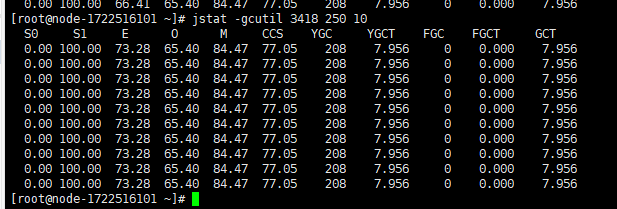

## 虚拟机性能监控与故障处理工具

### 常见故障：

- 内存溢出
- 死锁
- cpu 100%
- 系统越来越慢
- 系统宕机 ...

### 常用命令行监控工具

| **名称** | **主要作用**                                                 |
| -------- | ------------------------------------------------------------ |
| jps      | JVM Process Status Tool，显示指定系统内所有的HotSpot虚拟机进程 |
| jstat    | JVM Statistics Monitoring Tool，用于收集HotSpot虚拟机各方面的运行数据 |
| jinfo    | Configuration Info for Java，显示虚拟机配置信息              |
| jmap     | Memory Map for Java，生成虚拟机的内存转存储快照（heapdump文件） |
| jhat     | JVM Heap Dump Browser，用于分析heapdump文件，它会建立一个HTTP/HTML服务器，让用户可以在浏览器上查看分析结果 |
| jstack   | Stack Trace for Java，显示虚拟机的线程快照                   |

#### jps：虚拟机进程状况工具

> ### jps命令格式：jps  [options]  [hostid]  
>
> **如：jps -l**

| **选项** | **作用**                                           |
| -------- | -------------------------------------------------- |
| -q       | 只输出LVMID，省略主类的名称                        |
| -m       | 输出虚拟机进程启动时传递给主类main()函数的参数     |
| -l       | 输出主类的全名，如果进程执行的是jar包，输出Jar路径 |
| -v       | 输出虚拟机进程启动时JVM参数                        |

#### jstat：虚拟机统计信息监视工具

> jstat命令格式：jstat  [option vmid [ interval[s|ms] [count] ] ]
>
> 参数interval和count代表查询间隔和次数，如果省略这两个参数，说明只查询一次；
>
> 假设需要每250毫秒查询一次进程ID为2764的垃圾收集状况，一共查询20次，
>
> 那命令应当是 ：*jstat –gc 3418 250 20*

| **选项**          | **作用**                                                     |
| ----------------- | ------------------------------------------------------------ |
| -class            | 监视类装载，卸载数量、总空间以及类装载所耗费的时间           |
| -gc               | 监视Java堆情况，包括Eden区、两个survivor区、老年代、永久代等的容量、已用空间、GC时间合计等信息 |
| -gccapacity       | 监视内容与-gc基本相同，但输出主要关注Java堆各个区域使用到的最大、最小空间 |
| -gcutil           | 监视内容与-gc基本相同，但输出主要关注已使用空间占总空间的百分比 |
| -gccause          | 与-gcutil功能一样，但是会额外输出导致上一次GC产生的原因      |
| -gcnew            | 监视新生代GC情况                                             |
| -gcnewcapacity    | 监视内容与-gcnew基本相同，输出主要关注使用到的最大、最小空间 |
| -gcold            | 监视老年代GC状况                                             |
| -gcoldcapacity    | 监视内容与-gcold基本相同，输出主要关注使用到的最大、最小空间 |
| -gcpermcapacity   | 输出永久代使用到的最大、最小空间                             |
| -compiler         | 输出JIT编译器编译过的方法、耗时等信息                        |
| -printcompilation | 输出已经被JIT编译的方法                                      |

jstat -gcutil 3418 250 10

输出如下：

- `S0`：堆上 Survivor space 0 区已使用空间的百分比
- `S1`：堆上 Survivor space 1 区已使用空间的百分比
- `E`：堆上 Eden 区已使用空间的百分比
- `O`：堆上 Old space 区已使用空间的百分比
- `M`：元数据区使用比例
- `CCS`：压缩使用比例
- `YGC`：从程序启动到采样时发生的 Minor GC 次数
- `YGCT`：从程序启动到采样时 Minor GC 所用的时间
- `FGC`：从程序启动到采样时发生的 Full GC 次数
- `FGCT`：从程序启动到采样时 Full GC 所用的时间
- `GCT`：从程序启动到采样时 GC 的总时间

[G1GC s0显示0% s1显示100%原因](https://hllvm-group.iteye.com/group/topic/42352)

[jstat命令详解](https://blog.csdn.net/zhaozheng7758/article/details/8623549)

#### jinfo：Java配置信息工具

> jinfo（Configuration Info for Java）的作用是实时地查看和调整虚拟机各项参数。
>
> *jinfo命令格式：jinfo [option] pid* 
>
> jinfo执行样例：
>
> [root@WC01 bin 18:21 #47]$ jinfo -flag MaxHeapSize 3850  -XX:MaxHeapSize=492830720
>
> -XX:MaxHeapSize=492830720

| **选项**         | **作用**                                          |
| ---------------- | ------------------------------------------------- |
| -flag            | 输出指定虚拟机参数，如jinfo -flag MaxHeapSize pid |
| -sysprops        | 输出虚拟机进程的System.getProperties()的内容      |
| -flag[+\|-] name | 修改虚拟机参数值                                  |
| -flag nam=value  | 同上                                              |

#### jmap：Java内存映像工具

> jmap（Memory Map for Java）命令用于生成堆转储快照
>
> jmap命令格式：jmap [option] vmid
>
> 其他比较“暴力”生成dump文件的手段
>
> 1、通过-XX:+HeapDumpOnOutOfMemoryError参数，可以让虚拟机在OOM异常出现之后自动生成dump文件；
>
> 2、通过-XX:HeapDumpOnCtrlBreak参数则可以使用[Ctrl]+[Break]键让虚拟机生成dump文件；
>
> 3、可在Linux系统下通过kill -3命令发送进程退出信号“吓唬”一下虚拟机，也能拿到dump文件。
>
> 实例：jmap -dump:format=b,file=heap.dmp 3418

| **选项**       | **作用**                                                     |
| -------------- | ------------------------------------------------------------ |
| -dump          | 生成Java堆转储快照。格式为：-dump:[live, ]format=b, file=<filename>，其中live子参数说明是否只dump出存活的对象 |
| -finalizerinfo | 显示在F-Queue中等待Finalizer线程执行finalize方法的对象。只在Linux/Solaris平台下有效 |
| -heap          | 显示Java堆详细信息，如使用哪种回收器、参数配置、分代状况等。只在Linux/Solaris平台下有效 |
| -histo         | 显示堆中对象统计信息，包括类、实例数量、合计容量             |
| -permstat      | 以ClassLoader为统计口径显示永久代内存状态。只在Linux/Solaris平台下有效 |
| -F             | 当虚拟机进程对-dump选项没有响应时，可使用这个选项强制生成dump快照。只在Linux/Solaris平台下有效 |

[MAT下载](https://www.eclipse.org/mat/downloads.php)

#### jhat：虚拟机堆转储快照分析工具（一般不用）

Sun JDK提供jhat（JVM Heap Analysis Tool）命令与jmap搭配使用，来分析jmap生成的堆转储快照。Jhat内置了一个微型的HTTP/HTML服务器。生产dump文件的分析结果后，可以在浏览器中查看。

**如：** **jhat heap.dmp**

用户在浏览器中输入http://localhost:7000/就可以看到分析结果了

一般用VisualVM 或者Memory Analyzer等工具来分析

#### jstack：Java堆栈跟踪工具

jstack（Stack Trace for Java）命令用于生产虚拟机当前时刻的线程快照（一般称为threaddump或者javacore文件）。线程快照就是当虚拟机内每一条线程正在执行的方法堆栈集合，生产线程快照的主要目的是定位线程出现长时间停顿的原因，如线程间死锁、死循环、请求外部资源导致长时间等待等都是导致线程长时间停顿的常见原因。线程出现停顿的时候通过jstack来查看各个线程的调用堆栈，就可以知道没有响应的线程到底在后台做些什么事情，或者等待着什么资源

*jstack命令格式：jstack [option] vmid*

实例:jstack -l 3418

| **选项** | **作用**                                     |
| -------- | -------------------------------------------- |
| -F       | 当正常输出的请求不被响应时，强制输出线程堆栈 |
| -l       | 除堆栈外，显示关于锁的附加信息               |
| -m       | 如果调用到本地方法的话，可以显示C/C++的堆栈  |

#### JDK的可视化工具

**JConsole: Java 监视与管理控制台**

**VisualVM：多合一故障处理工具**

其他工具：

- [arthas](https://alibaba.github.io/arthas/)：阿巴巴的监控工具，功能强大，开源。
- [Gumshoe](https://github.com/worstcase/gumshoe) -Gumshoe是一个JAVA程序检测工具，它能帮助你跟踪程序的负载和性能。它能通过度量TCP,UDP,CPU使用等信息，帮助你分析出资源的使用情况 ，同时它也提供了Java程序中调用栈的分析功能，比如提供某个方法调用的次数，频度等信息
- [LeakCanary](https://github.com/square/leakcanary) -内存泄漏一直是令Java程序员苦恼的问题，因为在你开发阶段很难察觉内存泄漏问题，而一旦到了生产环境，则可能因为它而造成严重的后果。LeakCanary是一个内存泄漏检查工具，只需要像下面这样简单加入LeakCanary，它便能全程监控你的应用，并在出现内存泄漏时给你发出警告。LeakCanary同时支持Android和Java
- [Automon](https://github.com/akullpp/awesome-java) Automon是一个非常灵活的JAVA监控工具，它结合了AOP(AspectJ)以及JDK和其他依赖库的功能特性，以声明方式去监控你的Java代码。它可以与JAMon，JavaSimon，Yammer Metrics，StatsD和像 perf4j,log4j,sl4j这样的logging库结合使用。
- [java-agent](https://github.com/dingjs/javaagent) 代码级别的java性能监控工具，只需要简单配置就可以生成每行代码每个方法运行的时间，并且所占资源很少。

#### 参数配置：

-XX:+PrintGC -XX:+PrintGCDetails -XX:+PrintGCTimeStamps -XX:+PrintGCDateStamps -XX:+PrintHeapAtGC -Xloggc:gc.log"