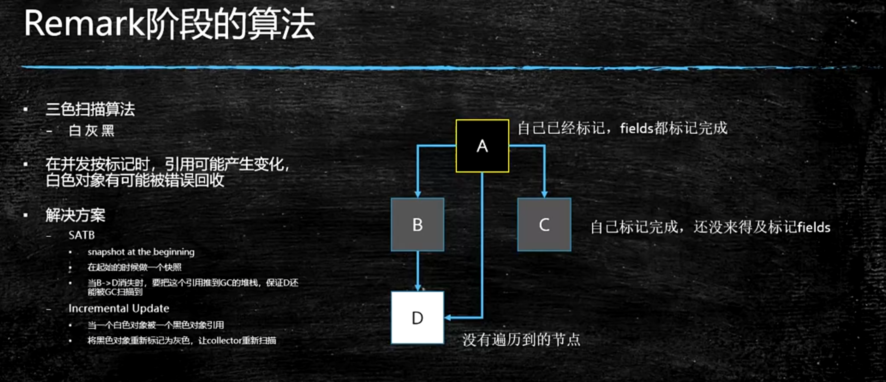

## 垃圾收集器和内存分配策略

### 垃圾收集器需要完成的三件事

- 哪些内存需要回收
- 什么时候回收
- 如何回收

### 对象已死？

#### 引用计数算法

#### 可达分析算法

通过 GC Roots 作为起始点进行搜索，能够到达到的对象都是存活的，不可达的对象可被回收


##### GC Roots对象

- 虚拟机栈（或者本地方法栈）中引用的对象
- 方法区中静态属性引用的变量
- 线程对象
- 方法区中常量引用的对象
- java虚拟机内部引用：包装类对象的Class对象，常驻的异常对象
- 被同步锁（Synchronized）持有的对象
- JMXBean、JVMTI中注册的回调、本地代码缓存

### 再谈引用


[链接](https://juejin.cn/post/6844904085091516430)

强： 当我们使用 new 这个关键字创建对象时创建出来的对象就是强引用(new出来对象为强引用)  如Object obj = new Object()  这个obj就是一个强引用了，如果一个对象具有强引用。垃圾回收器就不会回收有强引用的对象

软：

```java
  SoftReference<Student>studentSoftReference=new SoftReference<Student>(new Student());
  Student student = studentSoftReference.get();
  System.out.println(student);
```

当内存足够，不会被回收；但内存不足，在OOM前会进行第二次回收，软引用将被回收，如果还不够则OOM

应用：缓存

弱：存活至下次垃圾收集发生为止，一定会被回收

虚：无法通过虚引用获取对象，唯一的目的就是在这个对象被回收时收到一个系统通知shengc

### 生存还是死亡

#### 一个对象的死亡需要经历两次标记过程

- 可达分析之后没有雨GC Roots相连接的引用链：第一次标记
- 是否有必要执行finalize()方法(只会被执行一次)：如果对象没有覆盖finalize()方法，或者已经被虚拟机调用过：第二次标记

#### 对象逃逸：

在finalize()方法中GC Roots引用this

### 方法区回收

主要回收两部分：

- 废弃的常量
- 不再使用的类型

在大量使用反射、动态代理、CGLib等字节框架，动态生成自定义类加载器的场景中。通常需要需要jvm具备类型卸载的能力

### 垃圾收集算法

#### 分代收集理论

- 弱分代假说：绝大多数对象都是朝生夕死的
- 强分代假说：熬过越多次垃圾收集过程的对象就越难以消亡
- 跨代引用假说：跨代引用相对于同代引用来说仅占极少数
  - 不必记录对象是否存在及存在哪些跨代引用
  - 只需在新生代建立全局的数据结构（Remembered Set）,用于把老年代分成若干小块标识出老年代的哪一块内存会存在跨代引用


将回收的对象依据年龄分配到不同的区域之中存储

垃圾收集器每次回收某一个或者某些部分的区域

- Minor GC（Young GC）： 年轻代
- Major GC：老年代
- Full GC：整堆收集  java堆和方法区
- MixedGC：整个新生代和部分老年代（只有G1）


#### 标记-清除算法


#### 标记-复制算法


#### 标记-整理算法


### 垃圾收集器

JDK8默认:PS+PO

JDK9默认：G1





#### CMS方案：增量更新

- 浮动垃圾
- remark阶段会产生STW


### Garbage First GC


- Region单次回收的最小单元；可以避免整个Java堆中进行全区域的垃圾收集
- 逻辑上分代
- 物理上不分代：某一个Region区域既可以存储年轻代回收之后又可以存储老年代
- 回收时不用回收整个区域；优先收集存活数据最少的区域（垃圾优先）

CSet：垃圾收集器回收的Region组合；就是垃圾收集器收集需要收集的对象


**不用指定新生代和老年代的大小；因为G1能够自己动态的调节新生代和老年代的比例**


1.如果出现内存碎片  增加Region的大小

> -XX:G1HeapRegionSize  取值范围 1MB-32MB   且为2的N次幂


#### 记忆集与卡表（card table）


- 用于解决跨代引用带来的问题
- 新生代中建立Remembered Set （记忆集），用于存储老年代的数据；避免将整个老年代加进GCRoots扫描范围

使用Card Table来实现记忆集（BitMap）


#### 如果G1产生FGC，你应该做什么？

尽量让G1不要产生FGC；FGC在JDK10之前是串行的；10之后是并行的；

    1. 扩内存
    2. 提高CPU性能（回收的快，业务逻辑产生对象的速度固定，垃圾回收越快，内存空间越大）
    3. 降低MixedGC触发的阈值，让MixedGC提早发生（默认是45%）


### jvm参数

java -help
或
java -?

 -开头：标准参数  所有的JVM都遵循

-X开头：非标准参数  各个JVM的实现都不相同，并且不保证向后兼容

-XX开头：不稳定参数 各个JVM的实现都不相同，并且不保证向后兼容，甚至随时会被取消

### GC常用参数

* -Xmn -Xms -Xmx -Xss
  年轻代 最小堆 最大堆 栈空间
* -XX:+UseTLAB
  使用TLAB，默认打开
* -XX:+PrintTLAB
  打印TLAB的使用情况
* -XX:TLABSize
  设置TLAB大小
* -XX:+DisableExplictGC
  System.gc()不管用 ，FGC
* -XX:+HeapDumpOnOutOfMemoryError   -XX:HeapDumpPath=/opt/thunisoft/dump/imp/java_error_in_xxx.hprof 

* -XX:+PrintGC

* -XX:+PrintGCDetails

* -XX:+PrintHeapAtGC

* -XX:+PrintGCTimeStamps

* -XX:+PrintGCApplicationConcurrentTime (低)
  打印应用程序时间

* -XX:+PrintGCApplicationStoppedTime （低）
  打印暂停时长

* -XX:+PrintReferenceGC （重要性低）
  记录回收了多少种不同引用类型的引用

* -verbose:class
  类加载详细过程

* -XX:+PrintVMOptions

* -XX:+PrintFlagsFinal  -XX:+PrintFlagsInitial
  必须会用

  如：java -XX:+PrintFlagsFinal   -version | grep G1

* -Xloggc:opt/log/gc.log

* -XX:MaxTenuringThreshold
  升代年龄，最大值15

* 锁自旋次数 -XX:PreBlockSpin 热点代码检测参数-XX:CompileThreshold 逃逸分析 标量替换 ... 
  这些不建议设置

> 例如：-XX:+PrintGC -XX:+PrintGCDetails -XX:+PrintGCTimeStamps -XX:+PrintGCDateStamps -XX:+PrintHeapAtGC -Xloggc:gc.log -Xms2g -Xmx2g -XX:+UseG1GC -XX:+HeapDumpOnOutOfMemoryError -XX:HeapDumpPath=/opt/dump/java_error_in_gateway_%p.hprof

### Parallel常用参数

* -XX:SurvivorRatio
* -XX:PreTenureSizeThreshold
  大对象到底多大
* -XX:MaxTenuringThreshold
* -XX:+ParallelGCThreads
  并行收集器的线程数，同样适用于CMS，一般设为和CPU核数相同
* -XX:+UseAdaptiveSizePolicy
  自动选择各区大小比例

### CMS常用参数

* -XX:+UseConcMarkSweepGC
* -XX:ParallelCMSThreads
  CMS线程数量
* -XX:CMSInitiatingOccupancyFraction
  使用多少比例的老年代后开始CMS收集，默认是68%(近似值)，如果频繁发生SerialOld卡顿，应该调小，（频繁CMS回收）
* -XX:+UseCMSCompactAtFullCollection
  在FGC时进行压缩
* -XX:CMSFullGCsBeforeCompaction
  多少次FGC之后进行压缩
* -XX:+CMSClassUnloadingEnabled
* -XX:CMSInitiatingPermOccupancyFraction
  达到什么比例时进行Perm回收
* GCTimeRatio
  设置GC时间占用程序运行时间的百分比
* -XX:MaxGCPauseMillis
  停顿时间，是一个建议时间，GC会尝试用各种手段达到这个时间，比如减小年轻代

### G1常用参数

* -XX:+UseG1GC
* -XX:MaxGCPauseMillis
  建议值，G1会尝试调整Young区的块数来达到这个值
* -XX:GCPauseIntervalMillis
  ？GC的间隔时间
* -XX:+G1HeapRegionSize
  分区大小，建议逐渐增大该值，1 2 4 8 16 32。
  随着size增加，垃圾的存活时间更长，GC间隔更长，但每次GC的时间也会更长
  ZGC做了改进（动态区块大小）
* G1NewSizePercent
  新生代最小比例，默认为5%
* G1MaxNewSizePercent
  新生代最大比例，默认为60%
* GCTimeRatio
  GC时间建议比例，G1会根据这个值调整堆空间
* ConcGCThreads
  线程数量
* InitiatingHeapOccupancyPercent
  启动G1的堆空间占用比例


#### 作业

1. -XX:MaxTenuringThreshold控制的是什么？
   A: 对象升入老年代的年龄
     	B: 老年代触发FGC时的内存垃圾比例

2. 生产环境中，倾向于将最大堆内存和最小堆内存设置为：（为什么？）
   A: 相同 B：不同

3. JDK1.8默认的垃圾回收器是：
   A: ParNew + CMS
     	B: G1
     	C: PS + ParallelOld
     	D: 以上都不是

4. 什么是响应时间优先？

5. 什么是吞吐量优先？

6. ParNew和PS的区别是什么？

7. ParNew和ParallelOld的区别是什么？（年代不同，算法不同）

8. 长时间计算的场景应该选择：A：停顿时间 B: 吞吐量

9. 大规模电商网站应该选择：A：停顿时间 B: 吞吐量

10. HotSpot的垃圾收集器最常用有哪些？

11. 常见的HotSpot垃圾收集器组合有哪些？

12. JDK1.7 1.8 1.9的默认垃圾回收器是什么？如何查看？

13. 所谓调优，到底是在调什么？

14. 如果采用PS + ParrallelOld组合，怎么做才能让系统基本不产生FGC

15. 如果采用ParNew + CMS组合，怎样做才能够让系统基本不产生FGC

     1.加大JVM内存

     2.加大Young的比例

     3.提高Y-O的年龄

     4.提高S区比例

     5.避免代码内存泄漏

16. G1是否分代？G1垃圾回收器会产生FGC吗？  会分代，会产生FGC，当分配不下的时候就会产生

17. 如果G1产生FGC，你应该做什么？

        1. 扩内存
        2. 提高CPU性能（回收的快，业务逻辑产生对象的速度固定，垃圾回收越快，内存空间越大）
        3. 降低MixedGC触发的阈值，让MixedGC提早发生（默认是45%）

 18. 问：生产环境中能够随随便便的dump吗？
     小堆影响不大，大堆会有服务暂停或卡顿（加live可以缓解），dump前会有FGC

 19. 问：常见的OOM问题有哪些？
     栈 堆 MethodArea 直接内存
