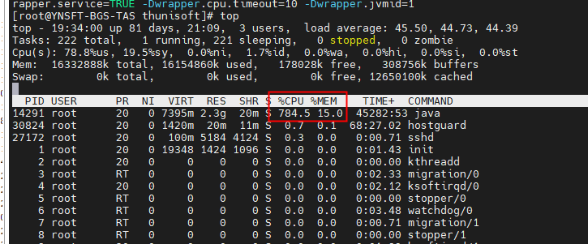
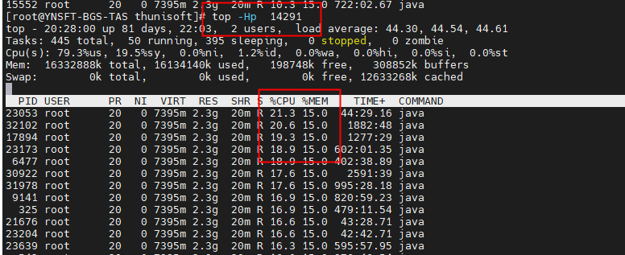
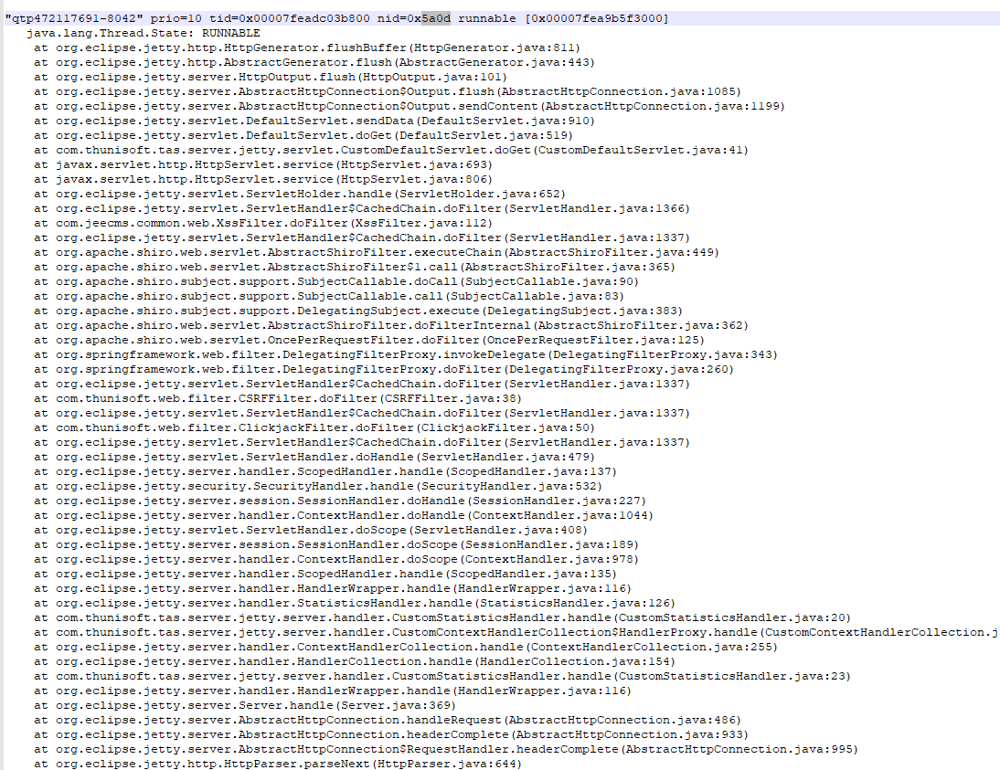
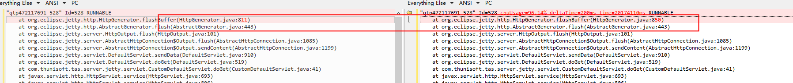

## 一次cpu100%的排查过程

使用`top`命令查看

查看cpu持续使用率很高，所以想这个程序正在运行什么，代码在跑什么这么耗cpu;

可以查看线程转储文件：

- 使用`top -Hp pid` 输入大写的 P 可以将线程按照 CPU 使用比例排序

为了方便定位问题我立马使用 `jstack pid > pid.log` 将线程栈 `dump` 到日志文件中。

把23053转成16进制为5a0d

感觉好像也看不出什么；

这里用第二种方法：

使用arthas attach 进程：

使用thread  -n 5 命令查看：查看耗cpu最高的5个线程，看日志跟上面的类似；

最开始感觉cpu就耗在这个线程上，怎么从日志中找到关键信息呢，好像看不出什么；最后从水哥那边得到提示，如果耗费cpu的线程id不变，一直是那几个线程，然后cpu100%很有可能就是死循环了；然后要怎么找到关键信息呢；`多打印几次线程转储日志，然后对比统一线程id的日志，看不同`  

从多次对比后发现：

然后找到代码，发现确认有一个do while循环，最后搜索发现是jetty的bug，升级jetty得以解决

### 总结：

- `top` 命令找到消耗cpu较高的进程id
- `top -Hp pid`命令找到线程id
- 利用多次线程转储日志对比找到日志中关键信息，找出线程重复执行的代码在哪块

