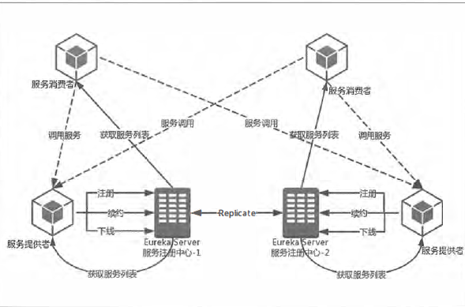
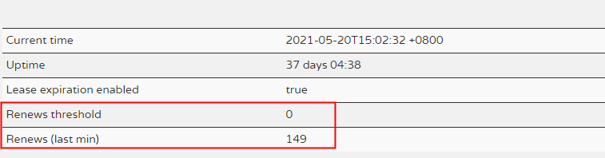

## 注册中心

### 服务治理

最初服务间的调用：

A服务->B服务 需要在A服务中静态的配置B服务的地址，维护一个实例清单

系统逐渐复杂 -- 静态配置会变得很难维护

> 解决服务实例维护的问题
>
> 通过服务的注册与发现完成自动化处理

#### 数据模型

注册中心的核心数据是:

- 服务的名字和它对应的网络地址，
- 健康状态、权重等属性
- 服务级别会设立一些属性
- 在服务和实例之间再设定一个数据级别。

#### 服务注册

服务向注册中心注册自己的服务；包括：主机，端口号，版本号，通讯协议

注册中心：

- 维护一个服务清单，客户端向服务端登记，发送请求
- 以心跳的方式监测清单中的服务是否有可用，不可用，剔除；客户端发送心跳

#### 服务发现

不通过具体实例地址而是通过实例名来发现，

过程：

- 向注册中心咨询获取服务清单
- 客户端自己从清单中轮询取出一个位置进行调用（客户端负载均衡）

### 注册中心的选型

| 比较项                       | Eureka               | zookeeper                     | Nacos                       | Consul                          |
| ---------------------------- | -------------------- | ----------------------------- | --------------------------- | ------------------------------- |
| 集群结构                     | 平级                 | 主从                          | 支持平级和主从              | 主从                            |
| 集群角色                     | 主人                 | Leader、follower observer     | leader、follower、candidate | server-leader、server以及client |
| 是否可以及时知道服务状态变化 | 不能及时知道         | 会及时知道                    | 不能及时知道                | 不能及时知道                    |
| 一致性协议（**CAP****）**    | 注重可用性（AP）     | 注重一致性(CP)                | 支持CP和AP-如何实现         | 注重一致性(CP)                  |
| 雪崩保护                     | 有                   | 没有                          | 有                          | 没有                            |
| 社区是否活跃                 | Eureka2.0不再维护了  | 持续维护                      | 持续维护                    | 持续维护                        |
| 管理端                       | 有现成的eureka管理端 | 没有现成的管理端              | 有现成的管理端              | 有现成的管理端                  |
| 负载均衡策略                 | 使用ribbon实现       | 一般可以直接采用RPC的负载均衡 | 权重/metadata/Selector      | Fabio                           |
| 权限控制                     | 无                   | 使用ACL实现节点权限控制       | RBAC-用户、角色、权限       | ACL                             |
| Spring Cloud集成             | 支持                 | 支持                          | 支持                        | 支持                            |
| 健康检查                     | Client Beat          | Keep Alive                    | TCP/HTTP/MYSQL/Client Beat  | TCP/HTTP/gRPC/Cmd               |
| 自动注销实例                 | 支持                 | 支持                          | 支持                        | 不支持                          |
| 访问协议                     | HTTP                 | TCP                           | HTTP/DNS                    | HTTP/DNS                        |
| 是否可用作配置中心           | 否                   | 是                            | 是                          | 是                              |
| 多数据中心                   | 不支持               | 不支持                        | 不支持                      | 支持                            |
| 跨注册中心同步               | 不支持               | 不支持                        | 支持                        | 支持                            |
| Dubbo集成                    | 不支持               | 支持                          | 支持                        | 不支持                          |
| K8S集成                      | 支持                 | 支持                          | 支持                        | 支持                            |

### Netflix Eureka

#### Eureka 服务端

- 服务注册表：记录各个微服务信息，例如服务名称，ip，端口等。

  注册表提供 查询API（查询可用的微服务实例）和管理API（用于服务的注册和注销）。

- 服务注册与发现：注册：将微服务信息注册到注册中心。发现：查询可用微服务列表及其网络地址。

- 服务检查：定时检测已注册的服务，如发现某实例长时间无法访问，就从注册表中移除。

- 分片出现故障，转入我保护模式；恢复正常，同步状态

#### Eureka客户端

- 通过注解和参数配置嵌入应用程序中
- 向服务端注册自身的服务：每个微服务启动时，将自己的网络地址等信息注册到注册中心，注册中心会存储（内存中）这些信息。
- 获取服务注册表：服务消费者从注册中心，查询服务提供者的网络地址，并使用该地址调用服务提供者，为了避免每次都查注册表信息，所以client会定时去server拉取注册表信息到缓存到client本地。
- 周期性发送心跳更新服务租约
- 向服务端查询当前服务信息并缓存到本地，周期性刷新服务状态
- 正常关闭发送服务下线消息给服务端

### 配置信息

#### 服务端：

> @EnableEurekaServer 注解标识为服务端
>
> server.port=1111
>
> eureka.instance.hostname=localhost
>
> // 是否向注册中新注册自己默认true
>
> eureka.client.register-with-eureka=false
>
> //是否需要向注册中新去检索服务，默认true
>
> eureka.client.fetch-registry=false
>
> eureka.client.serviceUrl.defaultZone=http://${eureka.instance.hostname}:${server.port}/eureka/

#### 客户端

> @EnableDiscoveryClient 注解标识为客户端
>
> eureka.client.serviceUrl.defaultZone=http://localhost:1111/eureka/

#### 高可用注册中心

##### peer1服务端

> spring.application.name=eureka-server
> server.port=1111
> eureka.instance.hostname=peer1
> eureka.client.serviceUrl.defaultZone=http://peer2:1112/eureka/

##### peer2服务端

> spring.application.name=eureka-server
> server.port=1112
> eureka.instance.hostname=peer2
> eureka.client.serviceUrl.defaultZone=http://peer1:1111/eureka/

在/etc/hosts文件中对peer1和peer2转换或者C:\Windows\System32\
drivers\etc\hosts。

> 127.0.0.1 peer1
> 127.0.0.1 peer2

##### 客户端配置多个服务端

> spring.application.name=hello-service
> eureka.client.serviceUrl.defaultZone=http://peerl:1111/eureka/,http://peer2:1112/eureka/

##### 使用ip的方式注册到注册中心

> eureka.instance.prefer-ip-address=true   //默认为false

##### 使用ribbon实现客户端负载均衡

> 1.引包：
>
> <dependencies>
> <dependency>
> <groupid>org.springframework.boot</groupid>
> <artifactid>spring-boot-starter-web</artifac七Id>
> </dependency>
> <dependency>
> <groupid>org.springframework.cloud</groupid>
> <artifactid>spring-cloud-starter-eureka</artifactid>
> </dependency>
> <dependency>
> <groupid>org.springframework.cloud</groupid>
> <artifactid>spring-cloud-starter-ribbon</artifactid>
> </dependency>
> </dependencies>
>
> 2.创建RestTemplate实例：
>
> @Bean
> @LoadBalanced
> RestTemplate restTemplate () {
> return new RestTemplate ();
> ｝
>
> 3.接口通过服务名调用，之后自动负载均衡
>
> ```java
> @RestController
> public class ConsumerController {
>     @Autowired
>     RestTemplate restTemplate;
>     
>     @RequestMapping(value = "/ribbon-consumer",method = RequestMethod.GET)
>     public String helloConsumer () {
>         return restTemplate.getForEntity("http://HELLO-SERVICE/hello",
>         String.class).getBody();
> 	}
> }
> ```

### Eureka详解



#### 服务提供者

##### 服务续约配置：

> eureka.instance.lease-renewal-interval-in-seconds=30  //服务续约任务的调用间隔时间 默认30s
> eureka.instance.lease-expiration-duration-in-seconds=90  // 服务失效的时间  默认90s


#### 服务消费者

**Eureka Server会维护一份只读的服务清单来返回给客户端，同时该缓**
**存清单会每隔30秒更新一次**

获取服务清单配置：

> eureka.client.fetch-registry=true  //默认为true
>
> eureka.client.registry-fetch-interval-seconds=30  //修改缓存清单的更新时间 默认30s
>
> eureka.client.instance-info-replication-interval-seconds=30  //更新实例信息的变化到Eureka服务端的间隔时间 默认30s


客户端程序中， 当服务实例进行正常的关闭操作时， 它会触发一个服务下线的REST请求给Eurke a Server, 告诉服务注册中心：“我要下线了”。

#### 服务端

##### 失效剔除

Eureka Serve默认每隔一段时间（默认为60秒） 将当前清单中超时（默认为90秒）没有续约的服务剔
除出去

##### 自我保护

触发条件：统计心跳成功的比例在15分钟之内是否低于85%

（当每分钟心跳次数( renewsLastMin ) 小于 numberOfRenewsPerMinThreshold 时，并且开启自动保护模式开关( eureka.server.enable-self-preservation = true ) 时，触发自我保护机制，不再自动过期租约。）



EurekaServer会将当前的实例注册信息保护起来，让这些实例不会过期， 尽可能保护这些注册信
息

配置：

> eureka.server.enable-self-preservation=false //关闭保护机制 ，确保注册中心可以将不可用的实
> 例正确剔除。
>
> - *eureka.server.enable-self-preservation*：禁用自我*保存的*配置–默认值为*true*
> - *eureka.server.expected-client-renewal-interval-seconds*：服务器以此属性配置的间隔期望客户端心跳–默认值为*30*
> - *eureka.instance.lease-expiration-duration-in-seconds*：表示Eureka服务器自从客户端收到最后一个心跳后可以将其从注册表中删除之前等待的时间（以秒为单位）–默认值为*90*
> - *eureka.server.eviction-interval-timer-in-ms*：此属性告诉Eureka服务器以该频率运行作业以驱逐到期的客户端-默认值为*60* *秒*
> - *eureka.server.renewal-percent-threshold*：基于此属性，服务器将计算所有已注册客户端每分钟的预期心跳–默认值为*0.85*  当心跳低于这个阈值时将触发自我保护机制
> - *eureka.server.renewal-threshold-update-interval-ms*：此属性告诉Eureka服务器以该频率运行作业，以计算该分钟所有注册客户端的预期心跳–默认值为*15分钟*

### Eureka Rest API

 [Eureka Server的REST API汇总](https://www.huaweicloud.com/articles/3af73af6fdf2059336e9919f2b4883de.html)

[GITHUB](https://github.com/Netflix/eureka/wiki/Eureka-REST-operations)

### 源码

#### 客户端

##### 程序入口

```java
 @Inject
    DiscoveryClient(ApplicationInfoManager applicationInfoManager, EurekaClientConfig config, AbstractDiscoveryClientOptionalArgs args,
                    Provider<BackupRegistry> backupRegistryProvider, EndpointRandomizer endpointRandomizer) {
        if (args != null) {
            this.healthCheckHandlerProvider = args.healthCheckHandlerProvider;
            this.healthCheckCallbackProvider = args.healthCheckCallbackProvider;
            this.eventListeners.addAll(args.getEventListeners());
            this.preRegistrationHandler = args.preRegistrationHandler;
        } else {
            this.healthCheckCallbackProvider = null;
            this.healthCheckHandlerProvider = null;
            this.preRegistrationHandler = null;
        }
        
        this.applicationInfoManager = applicationInfoManager;
        InstanceInfo myInfo = applicationInfoManager.getInfo();

        clientConfig = config;
        staticClientConfig = clientConfig;
        transportConfig = config.getTransportConfig();
        instanceInfo = myInfo;
        if (myInfo != null) {
            appPathIdentifier = instanceInfo.getAppName() + "/" + instanceInfo.getId();
        } else {
            logger.warn("Setting instanceInfo to a passed in null value");
        }

        this.backupRegistryProvider = backupRegistryProvider;
        this.endpointRandomizer = endpointRandomizer;
        this.urlRandomizer = new EndpointUtils.InstanceInfoBasedUrlRandomizer(instanceInfo);
        localRegionApps.set(new Applications());

        fetchRegistryGeneration = new AtomicLong(0);

        remoteRegionsToFetch = new AtomicReference<String>(clientConfig.fetchRegistryForRemoteRegions());
        remoteRegionsRef = new AtomicReference<>(remoteRegionsToFetch.get() == null ? null : remoteRegionsToFetch.get().split(","));

        if (config.shouldFetchRegistry()) {
            this.registryStalenessMonitor = new ThresholdLevelsMetric(this, METRIC_REGISTRY_PREFIX + "lastUpdateSec_", new long[]{15L, 30L, 60L, 120L, 240L, 480L});
        } else {
            this.registryStalenessMonitor = ThresholdLevelsMetric.NO_OP_METRIC;
        }

        if (config.shouldRegisterWithEureka()) {
            this.heartbeatStalenessMonitor = new ThresholdLevelsMetric(this, METRIC_REGISTRATION_PREFIX + "lastHeartbeatSec_", new long[]{15L, 30L, 60L, 120L, 240L, 480L});
        } else {
            this.heartbeatStalenessMonitor = ThresholdLevelsMetric.NO_OP_METRIC;
        }

        logger.info("Initializing Eureka in region {}", clientConfig.getRegion());

        if (!config.shouldRegisterWithEureka() && !config.shouldFetchRegistry()) {
            logger.info("Client configured to neither register nor query for data.");
            scheduler = null;
            heartbeatExecutor = null;
            cacheRefreshExecutor = null;
            eurekaTransport = null;
            instanceRegionChecker = new InstanceRegionChecker(new PropertyBasedAzToRegionMapper(config), clientConfig.getRegion());

            // This is a bit of hack to allow for existing code using DiscoveryManager.getInstance()
            // to work with DI'd DiscoveryClient
            DiscoveryManager.getInstance().setDiscoveryClient(this);
            DiscoveryManager.getInstance().setEurekaClientConfig(config);

            initTimestampMs = System.currentTimeMillis();
            logger.info("Discovery Client initialized at timestamp {} with initial instances count: {}",
                    initTimestampMs, this.getApplications().size());

            return;  // no need to setup up an network tasks and we are done
        }

        try {
            // default size of 2 - 1 each for heartbeat and cacheRefresh
            scheduler = Executors.newScheduledThreadPool(2,
                    new ThreadFactoryBuilder()
                            .setNameFormat("DiscoveryClient-%d")
                            .setDaemon(true)
                            .build());

            heartbeatExecutor = new ThreadPoolExecutor(
                    1, clientConfig.getHeartbeatExecutorThreadPoolSize(), 0, TimeUnit.SECONDS,
                    new SynchronousQueue<Runnable>(),
                    new ThreadFactoryBuilder()
                            .setNameFormat("DiscoveryClient-HeartbeatExecutor-%d")
                            .setDaemon(true)
                            .build()
            );  // use direct handoff

            cacheRefreshExecutor = new ThreadPoolExecutor(
                    1, clientConfig.getCacheRefreshExecutorThreadPoolSize(), 0, TimeUnit.SECONDS,
                    new SynchronousQueue<Runnable>(),
                    new ThreadFactoryBuilder()
                            .setNameFormat("DiscoveryClient-CacheRefreshExecutor-%d")
                            .setDaemon(true)
                            .build()
            );  // use direct handoff

            eurekaTransport = new EurekaTransport();
            scheduleServerEndpointTask(eurekaTransport, args);
                    ...
                    ...
                    ...
```


##### 拉取注册表并缓存到本地

```java
com.netflix.discovery.DiscoveryClient#getAndStoreFullRegistry
private void getAndStoreFullRegistry() throws Throwable {
        long currentUpdateGeneration = fetchRegistryGeneration.get();

        logger.info("Getting all instance registry info from the eureka server");

        Applications apps = null;
        EurekaHttpResponse<Applications> httpResponse = clientConfig.getRegistryRefreshSingleVipAddress() == null
                ? eurekaTransport.queryClient.getApplications(remoteRegionsRef.get())
                : eurekaTransport.queryClient.getVip(clientConfig.getRegistryRefreshSingleVipAddress(), remoteRegionsRef.get());
        if (httpResponse.getStatusCode() == Status.OK.getStatusCode()) {
            apps = httpResponse.getEntity();
        }
        logger.info("The response status is {}", httpResponse.getStatusCode());

        if (apps == null) {
            logger.error("The application is null for some reason. Not storing this information");
        } else if (fetchRegistryGeneration.compareAndSet(currentUpdateGeneration, currentUpdateGeneration + 1)) {
            localRegionApps.set(this.filterAndShuffle(apps));
            logger.debug("Got full registry with apps hashcode {}", apps.getAppsHashCode());
        } else {
            logger.warn("Not updating applications as another thread is updating it already");
        }
    }
```

