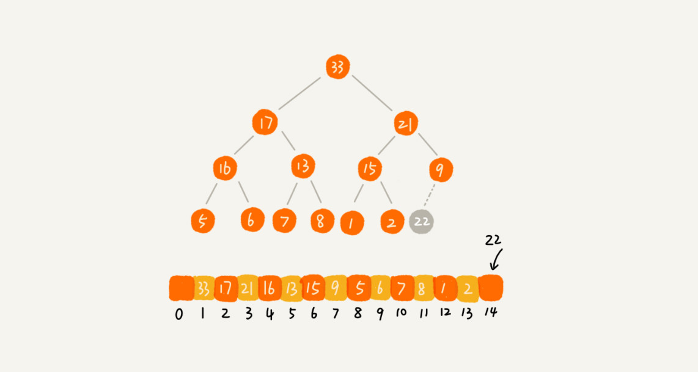

## 聊聊堆（Heap）

### 堆是一种特殊的树

- 堆是一个完全二叉树；
- 堆中每一个节点的值都必须大于等于（或小于等于）其子树中每个节点的值。

### 完全二叉树

- 完全二叉树要求，除了最后一层，其他层的节点个数都是满的，最后一层的节点都靠左排列

如下图：1,2是大顶堆；3是小顶堆；4不是堆


### 如何实现一个堆（大顶堆为例）

- 完全二叉树比较适合用数组来存储

#### 往堆中插入一个元素

- 插入并调整称为**堆化** ，堆化其实非常简单，就是顺着节点所在的路径，向上或者向下，对比，然后交换



- 向上堆化


```java

public class Heap {
  private int[] a; // 数组，从下标1开始存储数据
  private int n;  // 堆可以存储的最大数据个数
  private int count; // 堆中已经存储的数据个数

  public Heap(int capacity) {
    a = new int[capacity + 1];
    n = capacity;
    count = 0;
  }

  public void insert(int data) {
    if (count >= n) return; // 堆满了
    ++count;
    a[count] = data;
    int i = count;
    while (i/2 > 0 && a[i] > a[i/2]) { // 自下往上堆化
      swap(a, i, i/2); // swap()函数作用：交换下标为i和i/2的两个元素
      i = i/2;
    }
  }
 }
```

#### 删除堆顶元素


这样会有一个问题就是最后堆化出来的堆并不满足完全二叉树的特性。

如何解决：

**向下堆化**

我们把最后一个节点放到堆顶，然后利用同样的父子节点对比方法。对于不满足父子节点大小关系的，互换两个节点，并且重复进行这个过程，直到父子节点之间满足大小关系为止。这就是从上**往下的堆化**方法。


```java

public void removeMax() {
  if (count == 0) return -1; // 堆中没有数据
  a[1] = a[count];
  --count;
  heapify(a, count, 1);
}

private void heapify(int[] a, int n, int i) { // 自上往下堆化
  while (true) {
    int maxPos = i;
    if (i*2 <= n && a[i] < a[i*2]) maxPos = i*2;
    if (i*2+1 <= n && a[maxPos] < a[i*2+1]) maxPos = i*2+1;
    if (maxPos == i) break;
    swap(a, i, maxPos);
    i = maxPos;
  }
}
```

堆化的时间复杂度：O(logn)

一个包含 n 个节点的完全二叉树，树的高度不会超过 log2n。堆化的过程是顺着节点所在路径比较交换的，所以堆化的时间复杂度跟树的高度成正比，也就是 O(logn)。插入数据和删除堆顶元素的主要逻辑就是堆化，所以，往堆中插入一个元素和删除堆顶元素的时间复杂度都是 O(logn)

### java 中实现

#### PriorityQueue:

Java中*PriorityQueue*实现了*Queue*接口，不允许放入`null`元素；其通过堆实现，具体说是通过完全二叉树（*complete binary tree*）实现的**小顶堆**（任意一个非叶子节点的权值，都不大于其左右子节点的权值），也就意味着可以通过数组来作为*PriorityQueue*的底层实现

#### API

- 

```java
public boolean add(E e)
public boolean offer(E e)
```

- 获取堆顶元素不删除

```java 
public E peek()      //失败时返回null
public E element()   //失败时抛异常
```

- 获取并删除队首元素

```java
public E remove() //失败时抛异常
public E poll()  //失败时返回null
```

- 删除元素（如果有多个相等，只删除一个）

```java
 public boolean remove(Object o) 
```


#### 使用PriorityQueue实现大顶堆

PriorityQueue默认是一个小顶堆，然而可以通过传入自定义的Comparator函数来实现大顶堆。这里只是简单的传入一个自定义的Comparator函数，就可以实现大顶堆了。如下代码:

```java
 private static final int DEFAULT_INITIAL_CAPACITY = 11;
PriorityQueue<Integer> maxHeap=new PriorityQueue<Integer>(DEFAULT_INITIAL_CAPACITY, new Comparator<Integer>() {
        @Override
        public int compare(Integer o1, Integer o2) {                
            return o2-o1;
        }
    });
```

