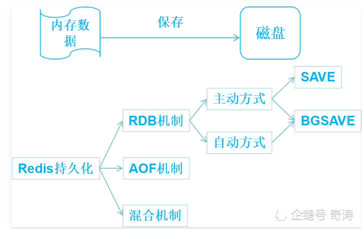

# 缓存那些事

## 缓存的使用场景

利用有限的资源来提供尽可能大的吞吐量；

- 需要经常查询经过复杂运算过后的数据： 例如实时查看当前在线数
- 对于查多写少的数据;   例如：微博

### 命中率

命中率=返回正确结果数/请求缓存次数，命中率问题是缓存中的一个非常重要的问题，它是衡量缓存有效性的重要指标。命中率越高，表明缓存的使用率越高。

### 最大元素（或最大空间）

缓存中可以存放的最大元素的数量，一旦缓存中元素数量超过这个值（或者缓存数据所占空间超过其最大支持空间），那么将会触发缓存启动清空策略根据不同的场景合理的设置最大元素值往往可以一定程度上提高缓存的命中率，从而更有效的时候缓存。

### 清空策略

如上描述，缓存的存储空间有限制，当缓存空间被用满时，如何保证在稳定服务的同时有效提升命中率？这就由缓存清空策略来处理，设计适合自身数据特征的清空策略能有效提升命中率。常见的一般策略有：

- **FIFO(first in first out)**

先进先出策略，最先进入缓存的数据在缓存空间不够的情况下（超出最大元素限制）会被优先被清除掉，以腾出新的空间接受新的数据。策略算法主要比较缓存元素的创建时间。在数据实效性要求场景下可选择该类策略，优先保障最新数据可用。

- **LFU(less frequently used)**

最少使用策略，无论是否过期，根据元素的被使用次数判断，清除使用次数较少的元素释放空间。策略算法主要比较元素的hitCount（命中次数）。在保证高频数据有效性场景下，可选择这类策略。

- **LRU(least recently used)**

最近最少使用策略，无论是否过期，根据元素最后一次被使用的时间戳，清除最远使用时间戳的元素释放空间。策略算法主要比较元素最近一次被get使用时间。在热点数据场景下较适用，优先保证热点数据的有效性。

除此之外，还有一些简单策略比如：

- 根据过期时间判断，清理过期时间最长的元素；
- 根据过期时间判断，清理最近要过期的元素；
- 随机清理；
- 根据关键字（或元素内容）长短清理等。

## 缓存的实现方式

### 本地缓存(local cache)

与应用在一个进程内部，访问速度快，适用于单应用不需要集群支持，或者集群情况下各节点无需相互通知的场景

缺点是：存跟应用程序耦合，多个应用无法直接共享缓存，各应用维护自己的内存，对内存浪费

#### 成员变量或局部变量实现

#### 静态变量实现

使用HashMap缓存

##### 优点：

实现比较简单

##### 缺点：

- 无法进行数据淘汰，数据会无限制增长

- 锁竞争严重，可以看见我的代码中，Lock是全局锁，在方法级别上面的，当调用量较大时，性能必然会比较低。
- 不支持过期时间
- 不支持自动刷新

##### 常见的三种淘汰算法:FIFO,LRU,LFU

- FIFO:先进先出，在这种淘汰算法中，先进入缓存的会先被淘汰。这种可谓是最简单的了，但是会导致我们命中率很低。试想一下我们如果有个访问频率很高的数据是所有数据第一个访问的，而那些不是很高的是后面再访问的，那这样就会把我们的首个数据但是他的访问频率很高给挤出。

- LRU:最近最少使用算法。在这种算法中避免了上面的问题，每次访问数据都会将其放在我们的队尾，如果需要淘汰数据，就只需要淘汰队首即可。但是这个依然有个问题，如果有个数据在1个小时的前59分钟访问了1万次(可见这是个热点数据),再后一分钟没有访问这个数据，但是有其他的数据访问，就导致了我们这个热点数据被淘汰。

- LFU:最近最少频率使用。在这种算法中又对上面进行了优化，利用额外的空间记录每个数据的使用频率，然后选出频率最低进行淘汰。这样就避免了LRU不能处理时间段的问题。

#### Ehcache

#### Guava Cache

### 分布式缓存(remote cache)

应用与缓存组建分离；

优点：本身是一个独立的应用，多个应用可以直接共享缓存；

#### memcached缓存

#### Redis缓存

##### Redis数据刷盘

https://cloud.tencent.com/developer/news/607786

RDB机制：也叫快照机制，将某一时刻的内存快照数据以二进制方式写入磁盘。RDB机制会生成全量rdb文件，效率较低

- 主动方式
- 自动方式

AOF机制：将收到的每一个写命令按顺序追加到aof文件中，由于每一个写命令都被顺序记录下来，我们只要将这个aof文件执行一遍，即可得到全部的数据。

- **AOF文件重写：**AOF机制也带来了一个问题:AOF文件会越来越大。为此，Redis提供了一个AOF文件重写的功能，将内存中的全部数据以命令的方式全部重写为一个新的AOF文件，来替换之前的AOF文件。

## 缓存碰到的问题

### 缓存穿透

缓存没有发挥作用；虽然做了缓存，但缓存中没有数据，还是需要再次去存储系统中去查询数据

#### 存储数据不存在

- 查询结果为null的数据，碰到黑客攻击；方案：查询结果为null也缓存当前的key

#### 缓存数据生成耗费大量时间和资源

- 如缓存分页的数据，碰到网络爬虫
- 并没有比较好的解决方案，只能监控之后发现问题再想办法处理

### 缓存雪崩

缓存失效（过期）后引起系统性能急剧下降；

缓存失效->业务系统新生成缓存+接收到外部请求->存储累计得到大量的请求->可能造成数据库宕机->雪崩

#### 解决方案

##### 更新锁机制（更简单）

对缓存更新操作进行加锁保护，保证每次只有一个线程能够更新缓存；未获取到锁的线程等待或者返回默认值；

##### 后台更细机制

缓存本省有效期为永久，后台线程定时更新缓存，业务系统不处理缓存；

可能的问题：缓存由于内存不足被剔除，导致数据查询不到

解决方案：

- 定时去查询，发现剔除了立刻更新缓存
- 业务系统发现失效，通过MQ发送消息通知后台线程更新

还适用于缓存预热

### 缓存热点

对于一个特别的热点数据如：微博热点；会对这份数据的缓存服务器造成很大压力；

解决方案：

复制多份缓存副本，将请求分散到多个缓存服务器上，减轻单台缓存服务器的压力

注意：

多个副本不要设置统一的过期时间，可能会出现同时失效的问题

设置一个过期时间范围，不同缓存副本的过期时间是指定范围内的随机值

