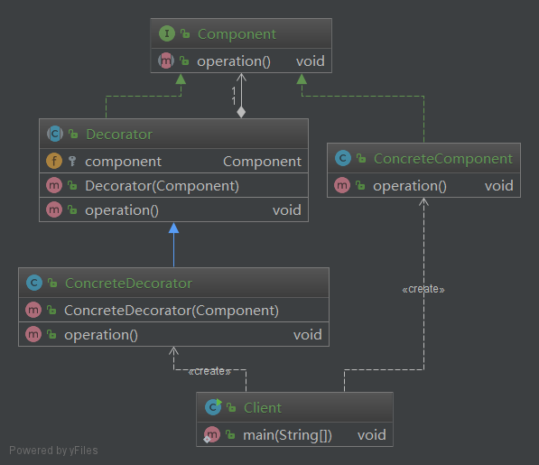

## 装饰器模式

使用oo的思想，对鸭子进行抽象，会抽象出一个超类Duck

之后所有的子类都继承这个超类Duck，这样子类就包含所有父类的方法和属性

这样会出现一个问题：

- 如果有鸭子需要fly的方法，修改超类Duck，这样会导致所有继承的子类都必须要包含fly方法，但有些鸭子并不会飞，如木头鸭子，这样就需要不会飞的鸭子子类都去覆盖父类的方法，这样就比较麻烦

这也就引出了第一个设计原则：

***把代码中变化的部分和不变化的部分分开，让变化的部分单独变化***

根据这一个原则我们就把fly方法单独出来，定义一个Flyable的接口，让会飞的鸭子实现这个接口就可以了；

为什么要定义接口？这样的目的是为了保证所有的鸭子对外都能表现出相同的行为，不会出现每个会飞的鸭子飞的方法名都不一样，调用也就会出现问题；如果以后飞的方法有改动，所有飞的方法可以同时修改；

这样也就引出了第二个设计原则：

***要依赖于抽象，不要依赖于具体***

这样又会导致另一个新的问题：

- 这样所有会飞的鸭子都必须自己去实现飞的方法，这样就会导致大量的代码重复

为了解决代码重复的问题，所以需要定义出已经实现fly方法的类，并且为不同飞的方法实现不同的类；可以定义出一个FlyBehavior接口，定义实现了FlyBehavior接口的实现类；然后在超类Duck中包含一个FlyBehavior变量；这样在子类中可以在构造函数中初始化FlyBehavior变量为自己需要的FlyBehavior接口的实现类；然后在fly方法中调用FlyBehavior中fly的方法；还可以在运行是动态的设置FlyBehavior变量的值，从而达到动态改变飞行为的目的；

这样又引出了第三个设计原则：

***组合优先于继承***

上述的实现其实就一种设计模式，这种设计模式就是策略模式，这个模式的定义是这样的：

***策略模式(Strategy Pattern)：定义一系列算法，将每一个算法封装起来，并让它们可以相互替换。策略模式让算法独立于使用它的客户而变化，也称为政策模式(Policy)***

策略模式是一种对象行为型模式

适用环境：

- 如果在一个系统里面有许多类，它们之间的区别仅在于它们的行为，那么使用策略模式可以动态地让一个对象在许多行为中选择一种行为
- 一个系统需要动态地在几种算法中选择一种
- 如果一个对象有很多的行为，如果不用恰当的模式，这些行为就只好使用多重的条件选择语句来实现
- 不希望客户端知道复杂的、与算法相关的数据结构，在具体策略类中封装算法和相关的数据结构，提高算法的保密性与安全性

解决一个实际的问题：

如果一个语句中if...else 太多，可对每个if...else中的算法就行封装，

